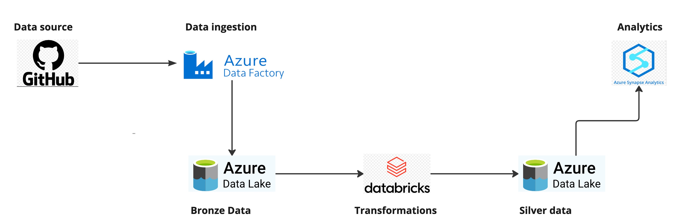

### Disclaimer
All the data used in this project is pseudodata and created with the following tools:
- SSN: https://www.lintukoto.net/muut/henkilotunnus/
- Business ID: https://telepartikkeli.azurewebsites.net/tunnusgeneraattori

### Project description

Contoso Bank wants to analyse their customer data, which is stored in a JSON format in GitHub. Data engineer should provide data for data analysts to answer the questions posed by the management. The data should fullfill the following criteria: 
1. Customer is alive (she has SSN)
2. Customer is a natural person (Not Business ID)
3. Valid contract with Contoso (Has a contract number)
4. Phone number with Finnish country code

#### Relevant links
- Kanban: https://miro.com/app/board/uXjVLejWrWU=/

### Project outcome
At the end of the project, data analysts should be able to answer the following questions: 
1. Do we have a list of phone numbers by preferred languague where send message in a case of service outgages? 
2. How many customers are using Finnish, English or Swedish as their preferred languague?

### Data description
In the data, we have the following columns. Customer id is either SSN or business id, phone number is in any format and contract number is a number which was created when the account was opened. 
```json
{
  "customer_id": "",
  "phone_number": "",
  "contract_number": "",
  "languague": ""
}
```

### Azure services
The following services are used. As a note, one could done this project only with, e.g. Databricks and Data lake, but for learning purposes different services are used: 
- Azure Data Factory
  - Data ingestion
- Azure Data Lake Gen 2
  - Data Storage
- Azure Databricks
  - Transformations
- Azure Synapse Analytics
  - Analytical queries

### Project architecture



1. Data is located in the project repository
2. Ingest data with Azure Data Factory
3. Store ingested Bronze data to Azure Data Lake
4. Make transformations with PySpark in Azure Databricks platform
5. Store Silver data to Azure Data Lake
6. Run analytical queries in Azure Synapse Analytics

## Steps

### Connection from Data Factory to GitHub